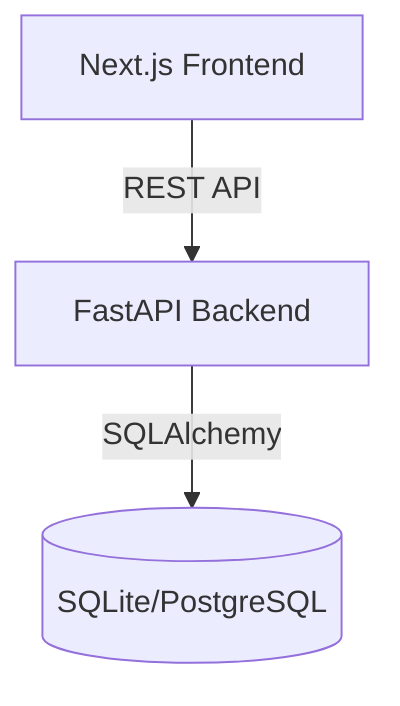
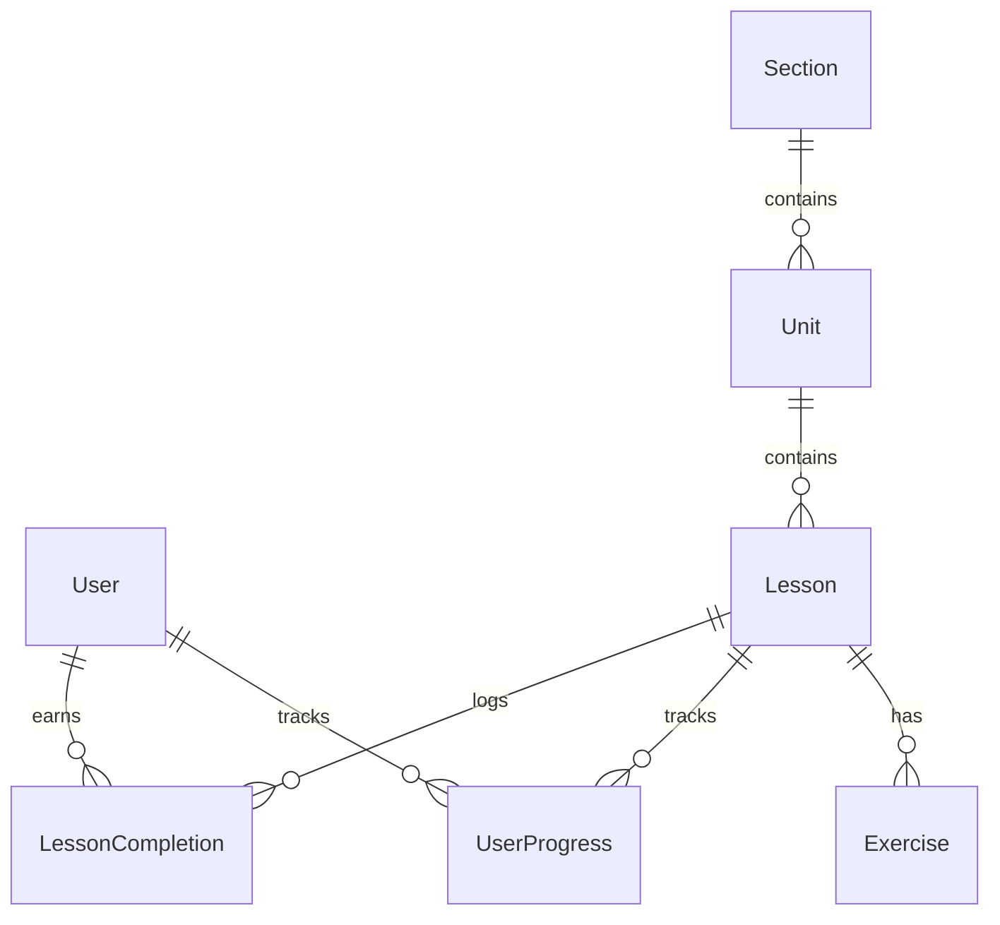

# Duolingo Clone

🚀 **Live Demo:** https://duolingo-app-jet.vercel.app/

## 1. Project Overview
This project is a full-stack web application inspired by Duolingo. It allows users to progress through a series of language-learning lessons organized in a learning tree (units and sections). It features a gamified learning experience with hearts, XP, and a daily streak system.

## 2. Features
- **Learning Tree**: Visual progression path with Sections, Units, and Lessons.
- **Interactive Lessons**: Support for multiple exercise types (translate, select, matching) with immediate feedback and success/failure animations.
- **Gamification**:
  - **Hearts**: Users lose hearts for incorrect answers. Hearts replenish daily or via practice lessons.
  - **XP & Leaderboard**: Earn XP for completing lessons and compete against other learners.
  - **Streak**: Maintain a daily streak by completing at least one lesson each day.
- **Responsive UI**: A polished, Duolingo-inspired interface that works seamlessly on desktop and mobile.
- **Dark Mode**: Fully supported dark mode UI.

## 3. Tech Stack
- **Frontend**: Next.js 14, React 18, Tailwind CSS, Lucide React (Icons), TypeScript.
- **Backend**: Python, FastAPI, SQLAlchemy, SQLite (default for local development).

## 4. Architecture
The application follows a decoupled client-server architecture. The Next.js frontend handles the user interface and state management for lessons, while the FastAPI backend provides a RESTful API and acts as the authoritative source of truth for user progress, XP, and streaks.



## 5. Frontend Architecture
The frontend is built with Next.js using the App Router.
- **Pages**: `app/page.tsx` (Dashboard/Tree), `app/lesson/[lessonId]/page.tsx` (Lesson Player).
- **Components**: Modular, reusable UI components for exercises, navigation, and gamification feedback.
- **Hooks**: Custom hooks (`useLesson`, `useUser`) manage API interaction and local caching.
- **Lesson Player**: A complex state machine orchestrating the queue of exercises, verifying answers via the backend, and handling animations/transitions.

## 6. Backend Architecture
The backend is a FastAPI application structured by domain.
- **Routers**: Organize API endpoints (`/users`, `/lessons`, `/exercises`, `/dashboard`).
- **Services**: Contain business logic and database interactions (`UserService`, `LessonService`). This isolates logic from the HTTP layer.
- **Models**: SQLAlchemy ORM models define the database schema.
- **Pydantic Schemas**: Define API request/response validation.

## 7. Database Schema
The database schema tracks the static lesson structure and the dynamic user state.



## 8. API Overview
Key REST endpoints:
- `GET /api/dashboard/{user_id}`: Fetches the full learning tree and user progress.
- `GET /api/users/{user_id}`: Retrieves user profile, XP, streak, and hearts.
- `GET /api/lessons/{lesson_id}`: Fetches the exercises for a lesson.
- `POST /api/lessons/{lesson_id}/complete`: Submits a completed lesson to award XP and unlock the next lesson.
- `POST /api/exercises/{exercise_id}/check`: Verifies an answer (authoritative check) and deducts hearts if incorrect.

## 9. Lesson Engine Architecture
The lesson engine operates in the `LessonPlayer` component.
- Exercises are loaded into a queue.
- The user answers the current exercise. The answer is sent to `POST /api/exercises/{exercise_id}/check`.
- If correct, the UI shows a success state and advances the queue.
- If incorrect, a heart is deducted (checked authoritatively). The failed exercise is pushed to the end of the queue.
- When the queue is empty, the lesson is submitted via `POST /api/lessons/{lesson_id}/complete`.

## 10. Gamification Rules
- **Hearts**: Start with 5 hearts. Lose 1 for each mistake. When at 0, the user cannot start new lessons but can do practice lessons to earn hearts back.
- **XP**: Earn 10-15 XP for a new lesson, 0 XP for practice lessons.
- **Streak**: Increments if a lesson (including practice) is completed. Resets if a day is missed. Handled securely on the backend to prevent duplication.

## 11. Local Setup
1. Clone the repository.
2. Install Python 3.9+ and Node.js 18+.
3. Set up the backend and frontend as described below.

## 12. Environment Variables
You need to create `.env` files based on the provided examples.

**Backend (`backend/.env`):**
Copy `backend/.env.example` to `backend/.env`.
```env
PROJECT_NAME="Duolingo Clone API"
API_V1_STR="/api"
SQLITE_URL="sqlite:///./duolingo.db"
FRONTEND_URL="http://localhost:3000"
```

**Frontend (`frontend/.env.local`):**
Copy `frontend/.env.example` to `frontend/.env.local`.
```env
NEXT_PUBLIC_API_URL="http://localhost:8000/api"
```

## 13. Database Initialization
The SQLite database will be automatically created when you run the backend or the seed script. Alembic can be used for migrations if configured.

## 14. Seed Instructions
Populate the database with initial users and lesson content:
```bash
cd backend
source venv/bin/activate
python seed.py
```
This script wipes existing data and recreates the learning tree (Sections -> Units -> Lessons -> Exercises) and seed users.

## 15. Running Frontend
```bash
cd frontend
npm install
npm run dev
```
The application will be available at `http://localhost:3000`.

## 16. Running Backend
```bash
cd backend
python -m venv venv
source venv/bin/activate
pip install -r requirements.txt
uvicorn app.main:app --reload --port 8000
```
API docs available at `http://localhost:8000/docs`.

## 17. Deployment Instructions
### Checklist
- [ ] **Environment Variables**: Configure all secrets (e.g., `DATABASE_URL`, `FRONTEND_URL`) in the production environment.
- [ ] **Database**: Provision a PostgreSQL instance and update `SQLITE_URL` (or equivalent `DATABASE_URL` variable) in the backend.
- [ ] **Backend**: Deploy the FastAPI app via Docker or a PaaS (Render, Railway, Heroku). Ensure the start command is `uvicorn app.main:app --host 0.0.0.0 --port $PORT`.
- [ ] **Frontend**: Deploy the Next.js app to Vercel or similar. Ensure `NEXT_PUBLIC_API_URL` points to your deployed backend URL.
- [ ] **CORS**: Ensure the backend's `FRONTEND_URL` exactly matches the production URL of the Next.js app to avoid CORS errors.

## 18. Assumptions
- This is a single-user simulation (hardcoded `user_id = 1` or default user selection) for demonstration purposes. Full authentication (JWT, OAuth) is excluded to focus on the core learning mechanics.
- The database uses SQLite by default for simplicity, but is structured with SQLAlchemy to easily swap to PostgreSQL.

## 19. Known Limitations
- No true authentication system.
- Audio and speech recognition exercises are mocked.
- Content is seeded statically and there is no admin panel to create new lessons dynamically.

## 20. Future Improvements
- Add Auth0 or next-auth for real user registration.
- Implement spaced repetition algorithms for practice lessons.
- Add real text-to-speech (TTS) for listening exercises.
- Create an admin dashboard for content creators.
